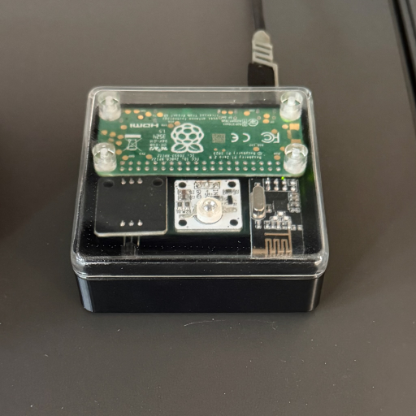

# Equilibrium

Open source network attached universal remote; aiming to become a drop-in replacement for Logitech's discontinued Harmony Hub.

**This software is in a very early stage of development and every update should be considered breaking!**

**Don't use this if you're looking for a stable piece of equipment that you can rely on!**

The setup currently requires at least some basic understanding of the Linux terminal, python and GPIO hardware.

If you run into any issues, check the [Troubleshooting](#troubleshooting) section. If you think you found a bug, please create an issue here on GitHub.

## Features

- [x] Record and send infrared commands
- [x] Emulate a bluetooth keyboard to control devices like the Apple TV (WIP)
- [x] Configurable scenes (activities) with user-definable start and stop macros
- [x] Track device state to make scene switches only execute necessary commands (WIP)
- [x] iOS app to control and manage the hub (Beta available in [Testflight](https://testflight.apple.com/join/dyzEZYMs), [source code](https://github.com/LeoKlaus/Equilibrium-iOS))
- [x] Works with the original Harmony companion remote
- [x] Frontend for Android/Web (Beta available [here](https://github.com/LeoKlaus/Equilibrium-Flutter))

### Todo
- [ ] Expand support for physical remotes
- [ ] Home Assistant integration
- [ ] Philips Hue integration?
- [ ] Amazon Alexa integration?
- [ ] Improve set up guide
- [ ] Add some form of IR database

## Setup and usage

I've created a [Wiki in this repo](https://github.com/LeoKlaus/Equilibrium/wiki) to cover the basic setup and usage of Equilibrium.

## Pictures

### The Hub

### The App

## Troubleshooting

If an error occurs, you should check the output from Equilibrium. If you have daemonized it, you can do so via `journalctl`.
In some cases, you may want to use the `--verbose` or `--debug` flags to get more verbose logs, though I don't recommend using either for longer times due to the number of log entries they create.